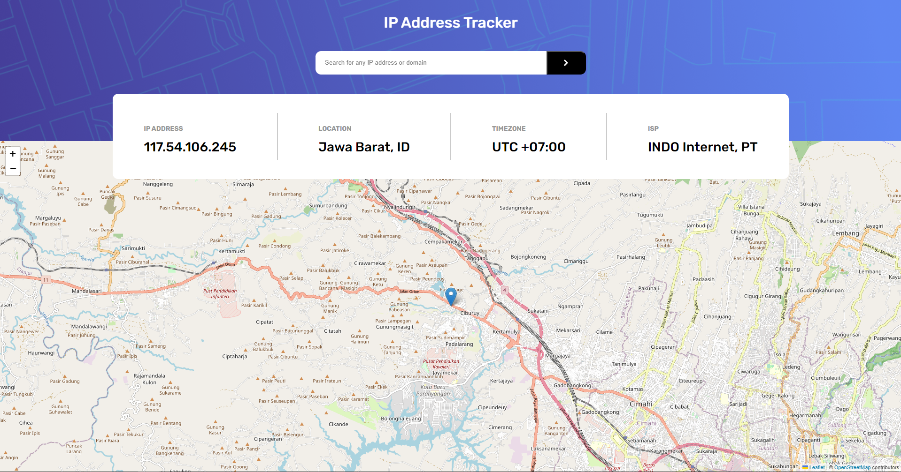
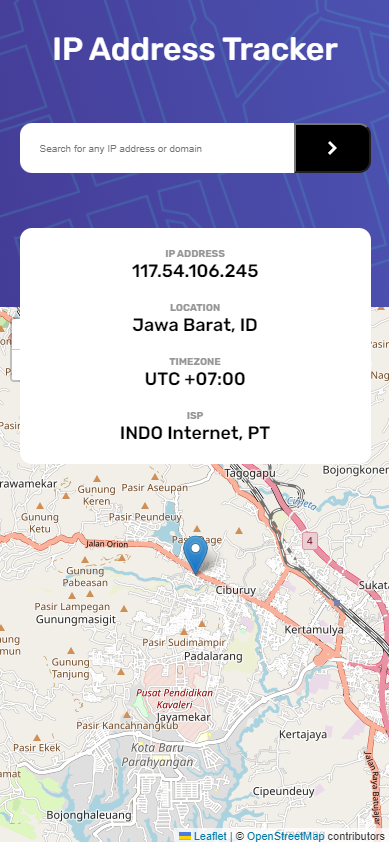

# Frontend Mentor - Advice generator app

This is a solution to the [IP Address Tracker](https://www.frontendmentor.io/challenges/ip-address-tracker-I8-0yYAH0). Frontend Mentor challenges help you improve your coding skills by building realistic projects. 
## Table of contents

- [Overview](#overview)
  - [Screenshot](#screenshot)
  - [Links](#links)
- [My process](#my-process)
  - [Built with](#built-with)
  - [What I learned](#what-i-learned)
  - [Continued development](#continued-development)
  - [Useful resources](#useful-resources)
- [Author](#author)
- [Acknowledgments](#acknowledgments)

## Overview
This repository contains my personal solution for [IP Address Tracker](https://www.frontendmentor.io/challenges/ip-address-tracker-I8-0yYAH0).

If there's any input/advice/recommendation that you want to add. Please send your comment in the issues tab.

Thank you! 🙏

### Screenshot

Desktop Screenshot:

Mobile Screenshot:

### Links

- Solution URL: [GitHub Solution URL here](https://github.com/farrel-hi/ip-address-tracker-react)
- Live Site URL: [Live site URL here](https://farrel-hi.github.io/ip-address-tracker-react/)

## My process
1. Create the HTML semantic structure first
2. Create the desktop rules first and then the mobile rules second using CSS
3. Create the function for accepting IP Address only input and show it's location information plus the location in map using JavaScript with the help of [IP Geolocation API by IPify](https://geo.ipify.org/) and [LeafletJS](https://leafletjs.com/).

### Built with

- Semantic HTML5 markup
- CSS custom properties
- JavaScript Function & DOM
- Flexbox
- React Hooks
- [IP Geolocation API by IPify](https://geo.ipify.org/)
- [LeafletJS](https://leafletjs.com/).
- [Publlic IP Address API](https://www.ipify.org/)

### What I learned

Here are the things that i learn:
1. Relearn and practice function in Javascript
2. Practices my CSS design
3. Learn how to use ip address and map generator API

### Continued development

I would like to continue develop my skill as a whole through projects from [Frontend Mentor](https://www.frontendmentor.io/).

### Useful resources

- [W3School](https://www.w3schools.com/)
- [HTML Documentation](https://developer.mozilla.org/en-US/docs/Web/HTML)

## Author

- Frontend Mentor - [@farrel-hi](https://www.frontendmentor.io/profile/farrel-hi)

## Acknowledgments
